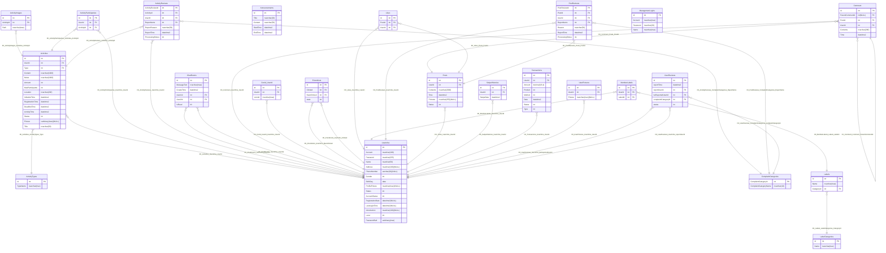

```mermaid
erDiagram
  Activities {
    Id int PK
    UserId int FK
    Type int FK
    Content nvarchar(1000) 
    Notes nvarchar(1000) 
    Amount int 
    MaxParticipants int 
    Location nvarchar(200) 
    InitiationTime datetime2 
    RegistrationTime datetime2 
    DeadlineTime datetime2 
    ActivityTime datetime2 
    Status int 
    Picture varbinary(max)(NULL) 
    Title nvarchar(50) 
  }
  Activities }o--|| ActivityTypes : FK_Activities_ActivityTypes_Type
  Activities }o--|| UserInfos : FK_Activities_UserInfos_UserId
  ActivityImages {
    Id int PK
    ActivityId int FK
    Path nvarchar(max) 
  }
  ActivityImages }o--|| Activities : FK_ActivityImages_Activities_ActivityId
  ActivityParticipantes {
    Id int PK
    UserId int FK
    ActivityId int FK
  }
  ActivityParticipantes }o--|| Activities : FK_ActivityParticipantes_Activities_ActivityId
  ActivityParticipantes }o--|| UserInfos : FK_ActivityParticipantes_UserInfos_UserId
  ActivityReviews {
    ActivityReviewId int PK
    ActivityId int FK
    UserId int FK
    ReportItems int FK
    ReportReason nvarchar(50) 
    ReportTime datetime2 
    ProcessingStstus int 
  }
  ActivityReviews }o--|| Activities : FK_ActivityReviews_Activities_ActivityId
  ActivityReviews }o--|| ComplaintCategories : FK_ActivityReviews_ComplaintCategories_ReportItems
  ActivityReviews }o--|| UserInfos : FK_ActivityReviews_UserInfos_UserId
  ActivityTypes {
    Id int PK
    TypeName nvarchar(max) 
  }
  Announcements {
    Id int PK
    Title nvarchar(20) 
    Content nvarchar(50) 
    StartTime datetime2 
    EndTime datetime2 
  }
  ChatRooms {
    Id int PK
    MessageText nvarchar(max) 
    CreateTime datetime2 
    User1Id int FK
    User2Id int FK
    IsRead bit 
  }
  ChatRooms }o--|| UserInfos : FK_ChatRooms_UserInfos_User1Id
  ChatRooms }o--|| UserInfos : FK_ChatRooms_UserInfos_User2Id
  Comment {
    Id int PK
    ParentCommentId int(NULL) FK
    PostId int FK
    UserId int FK
    Contents nvarchar(280) 
    Time datetime2 
  }
  Comment }o--|| Comment : FK_Comment_Comment_ParentCommentId
  Comment }o--|| Posts : FK_Comment_Posts_PostId
  Comment }o--|| UserInfos : FK_Comment_UserInfos_UserId
  ComplaintCategories {
    ComplaintCategoryId int PK
    ComplaintCategoryName nvarchar(10) 
  }
  ConId_UserId {
    Id int PK
    UserId int FK
    connId nvarchar(max) 
  }
  ConId_UserId }o--|| UserInfos : FK_ConId_UserId_UserInfos_UserId
  FriendLists {
    Id int PK
    Clicked int FK
    BeenClicked int FK
    state int 
  }
  FriendLists }o--|| UserInfos : FK_FriendLists_UserInfos_BeenClicked
  FriendLists }o--|| UserInfos : FK_FriendLists_UserInfos_Clicked
  LabelCategories {
    Id int PK
    Name nvarchar(max) 
  }
  Labels {
    Id int PK
    Name nvarchar(max) 
    CategoryId int FK
  }
  Labels }o--|| LabelCategories : FK_Labels_LabelCategories_CategoryId
  Likes {
    Id int PK
    PostId int FK
    UserId int FK
  }
  Likes }o--|| Posts : FK_Likes_Posts_PostId
  Likes }o--|| UserInfos : FK_Likes_UserInfos_UserId
  ManagemenLogins {
    Id int PK
    Account nvarchar(max) 
    Password nvarchar(20) 
    Name nvarchar(max) 
  }
  MemberLabels {
    Id int PK
    UserId int FK
    LabelId int FK
  }
  MemberLabels }o--|| Labels : FK_MemberLabels_Labels_LabelId
  MemberLabels }o--|| UserInfos : FK_MemberLabels_UserInfos_UserId
  PostReviews {
    PostReviewId int PK
    PostId int FK
    UserId int FK
    ReportItems int FK
    Reason nvarchar(50) 
    ReportTime datetime2 
    ProcessingStstus int 
  }
  PostReviews }o--|| ComplaintCategories : FK_PostReviews_ComplaintCategories_ReportItems
  PostReviews }o--|| Posts : FK_PostReviews_Posts_PostId
  PostReviews }o--|| UserInfos : FK_PostReviews_UserInfos_UserId
  Posts {
    Id int PK
    UserId int FK
    Contents nvarchar(2000) 
    Time datetime2 
    Pictures nvarchar(255)(NULL) 
    Status int 
  }
  Posts }o--|| UserInfos : FK_Posts_UserInfos_UserId
  SwipeHistories {
    Id int PK
    UserId int FK
    SwipeDate datetime2 
  }
  SwipeHistories }o--|| UserInfos : FK_SwipeHistories_UserInfos_UserId
  Transactions {
    Id int PK
    UserId int FK
    Amount decimal(18-4) 
    Product int 
    Method int 
    Date datetime2 
    Status int 
    Type int 
  }
  Transactions }o--|| UserInfos : FK_Transactions_UserInfos_UserId
  UserInfos {
    Id int PK
    Account nvarchar(100) 
    Password nvarchar(255) 
    Name nvarchar(50) 
    Address nvarchar(100)(NULL) 
    PhoneNumber varchar(20)(NULL) 
    Gender int 
    BirthDay date 
    ProfilePicture nvarchar(max)(NULL) 
    Status int 
    AccountStatus int 
    RegistrationDate datetime2(NULL) 
    LastLoginTime datetime2(NULL) 
    Introduction nvarchar(100)(NULL) 
    Level int 
    PasswordSalt varbinary(max) 
  }
  UserPictures {
    Id int PK
    UserId int FK
    Picture nvarchar(max)(NULL) 
  }
  UserPictures }o--|| UserInfos : FK_UserPictures_UserInfos_UserId
  UserReviews {
    Id int PK
    reportTime datetime2 
    reportUserId int FK
    beReportedUserId int FK
    complaintCategoryId int FK
    status int 
  }
  UserReviews }o--|| ComplaintCategories : FK_UserReviews_ComplaintCategories_complaintCategoryId
  UserReviews }o--|| UserInfos : FK_UserReviews_UserInfos_beReportedUserId
  UserReviews }o--|| UserInfos : FK_UserReviews_UserInfos_reportUserId
```
