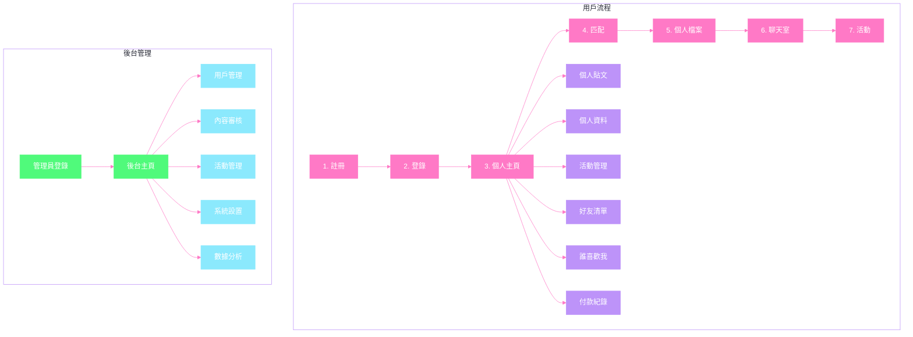

# HaveFun
HaveFunDev

ER diagram show with react
https://codesandbox.io/p/sandbox/happy-tess-9v3nyy?file=%2Fsrc%2Findex.js%3A13%2C3

# 使用者功能
1. **註冊/登入**
  * 一般使用者登入（可第三方登入）
  * 忘記密碼

2. **個人主頁**
  * 個人資料
    - 改標籤
    - 改密碼
    - 改大頭貼
    - 改個人資料
  * 誰喜歡我（一般會員模糊顯示）
  * 個人貼文
    - 點讚、回覆、分享
    - 檢舉、刪除
    - 可上傳圖片
  * 好友清單：封鎖/解封
  * 活動管理
    - 參與的活動
    - 發起的活動
  * 付款紀錄
    - 查詢
    - 退款（最後再做）

3. **配對**        
  * 篩選
  * 左/右滑
  * 優先推薦
  * 檢舉

4. **個人聊天室**     [林晉賢](https://github.com/linjinhsien/)
  * 一對一聊天

### class
[chatroom](https://github.com/Turner-Chang/HaveFun/blob/main/HaveFun/Models/ChatRoom.cs)
[ConId&UserId](https://github.com/Turner-Chang/HaveFun/blob/main/HaveFun/Models/ConId%26UserId.cs)
[ChatHub](https://github.com/Turner-Chang/HaveFun/blob/main/HaveFun/ChatHub.cs)

### controller
  [ChatRoomsController](https://github.com/Turner-Chang/HaveFun/blob/main/HaveFun/Controllers/ChatRoomsController.cs)
  [ChatRoomsApiController](https://github.com/Turner-Chang/HaveFun/blob/main/HaveFun/Controllers/APIs/ChatRoomsApiController.cs)
  [ConId_UserController](https://github.com/Turner-Chang/HaveFun/blob/main/HaveFun/Controllers/APIs/ConId_UserController.cs)
 ### view
 [chatroomview](https://github.com/Turner-Chang/HaveFun/blob/main/HaveFun/Views/ChatRooms/Main.cshtml)
 

5. **活動揪團**
  * 報名功能

6. **會員等級**
  * 購買白金會員

# 後臺功能
1. **使用者管理**
  * 封鎖/解封
  * 信箱驗證

2. **貼文審核**

3. **活動審核**

4. **用戶審核**

5. **標籤控管**
  * 新增標籤與標籤群組
  * 刪除標籤與標籤群組

6. **金流控管**（最後再做）
  * 會員付款紀錄
  * 修改價格

7. **圖表分析**（最後再做）

8. **公告管理**（最後再做）

9. **問題回報**
  * 聊天室方式呈現

10. **管理者待辦事項提醒**

